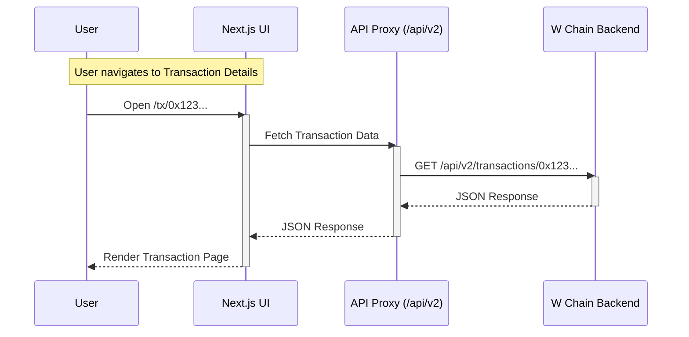

# W Chain Block Explorer (Frontend)

This repository contains the **Frontend** application for the W Chain Block Explorer. It is a customized fork of the [Blockscout Frontend](https://github.com/blockscout/blockscout-frontend), tailored to support W Chain's specific network parameters, branding, and theming.

> **Note**: This frontend is designed to work with the **W Chain Backend**.

## 📋 Prerequisites

Before setting up the frontend, ensure you have a running instance of the **W Chain Backend**. The backend handles indexing, database management, and API serving.

👉 **[W Chain Backend Documentation & Setup Guide](BACKEND_DEPLOYMENT_GUIDE.md)**

Please verify that the backend is fully synced and the API is accessible (usually at `http://localhost:4000` or your production URL).

---

## 🏗 Architecture & Data Flow

The W Chain Explorer uses a modern **Next.js** architecture that serves as the presentation layer. It does not index blockchain data directly; instead, it consumes APIs provided by the Blockscout Backend.

### High-Level Overview

```mermaid
graph TD
    User[User Browser]
    
    subgraph "Frontend (Next.js)"
        UI[React UI Components]
        Proxy[Internal Proxy API]
        Store[TanStack Query Cache]
    end
    
    subgraph "Backend (W Chain Fork)"
        API[Blockscout API]
        Indexer[Data Indexer]
        DB[(PostgreSQL)]
    end
    
    Node[W Chain Node (RPC)]

    %% Flows
    User -->|1. Load Page| UI
    UI -->|2. Fetch Data| Proxy
    Proxy -->|3. Forward Request| API
    API -->|4. Query| DB
    
    Indexer -->|Indexing| Node
    Indexer -->|Write Data| DB
    
    UI -.->|Direct RPC (Wallet Ops)| Node

    classDef component fill:#e1f5fe,stroke:#01579b,stroke-width:2px;
    classDef external fill:#f3e5f5,stroke:#4a148c,stroke-width:2px;
    
    class UI,Proxy,Store component;
    class API,Indexer,DB,Node external;
```

### Request Flow (Sequence)

The frontend uses an internal proxy (`/pages/api/proxy.ts`) to handle CORS and manage API connections securely.



---

## 🧩 W Chain Modifications

This repository includes several key modifications to suit the W Chain Network:

1.  **Branding & Identity**:
    *   Hardcoded "W Scan" branding in Footer and Header components.
    *   Custom links to `w-chain.com`.
    *   Specific copyright notices in `ui/snippets/footer/Footer.tsx`.

2.  **Network Configuration**:
    *   **Chain ID**: `171717`
    *   **Currency**: `W` (W Chain Token)
    *   **RPC Handling**: Optimized for W Chain's specific EVM implementation.

3.  **Theming**:
    *   Custom color palette and Chakra UI theme overrides to match W Chain branding.
    *   See `toolkit/theme` for style definitions.

---

## 🛠 Project Structure

```bash
blockscout-fe/
├── configs/          # ⚙️ Application configuration
│   ├── app/          # Core app settings (APIs, Chain ID, etc.)
│   └── envs/         # Environment variable presets
├── lib/              # 📚 Shared utilities
│   ├── api/          # API client and type definitions
│   └── web3/         # Wagmi/Viem Web3 hooks and setup
├── pages/            # 📄 Next.js Pages (Routes)
│   ├── api/          # Internal API routes (Proxy)
│   └── tx/, address/ # Page components
├── ui/               # 🎨 React UI Components
│   ├── home/         # Dashboard components
│   └── snippets/     # Reusable blocks (Footer, Navbar)
└── toolkit/          # 🧰 Theme and low-level helpers
```

---

## 🚀 Getting Started

### 1. Environment Setup

Copy the example environment file:

```bash
cp .env.example .env.local
```

### 2. Configure Environment Variables

Edit `.env.local` to point to your **W Chain Backend** and define network settings.

**Crucial Variables:**

```bash
# Backend Connection
NEXT_PUBLIC_API_HOST=localhost:4000
NEXT_PUBLIC_API_PROTOCOL=http
NEXT_PUBLIC_API_WEBSOCKET_PROTOCOL=ws

# Network Definition (W Chain)
NEXT_PUBLIC_NETWORK_NAME="W Chain"
NEXT_PUBLIC_NETWORK_SHORT_NAME="W Chain"
NEXT_PUBLIC_NETWORK_ID=171717
NEXT_PUBLIC_NETWORK_CURRENCY_NAME="W Token"
NEXT_PUBLIC_NETWORK_CURRENCY_SYMBOL="W"
NEXT_PUBLIC_NETWORK_CURRENCY_DECIMALS=18
NEXT_PUBLIC_NETWORK_RPC_URL=https://rpc.w-chain.com

# App Settings
NEXT_PUBLIC_APP_HOST=localhost:3000
NEXT_PUBLIC_APP_PROTOCOL=http
```

### 3. Install Dependencies

```bash
yarn install
# or
npm install
```

### 4. Run Development Server

```bash
yarn dev
# or
npm run dev
```

The application will be available at `http://localhost:3000`.

---

## 🧪 Testing

The project uses **Jest** for unit tests and **Playwright** for E2E testing.

```bash
# Run Unit Tests
yarn test

# Run E2E Tests
yarn playwright test
```

## 🤝 Contribution for Internal Devs

1.  **Code Style**: We use Prettier and ESLint. Run `yarn lint` before committing.
2.  **Modifying Branding**:
    *   Update `ui/snippets/footer/Footer.tsx` for footer changes.
    *   Update `toolkit/theme` for global color changes.
3.  **Adding New Env Vars**:
    *   Add them to `.env.example`.
    *   Register them in `configs/app/index.ts` or relevant config files to ensure type safety.
